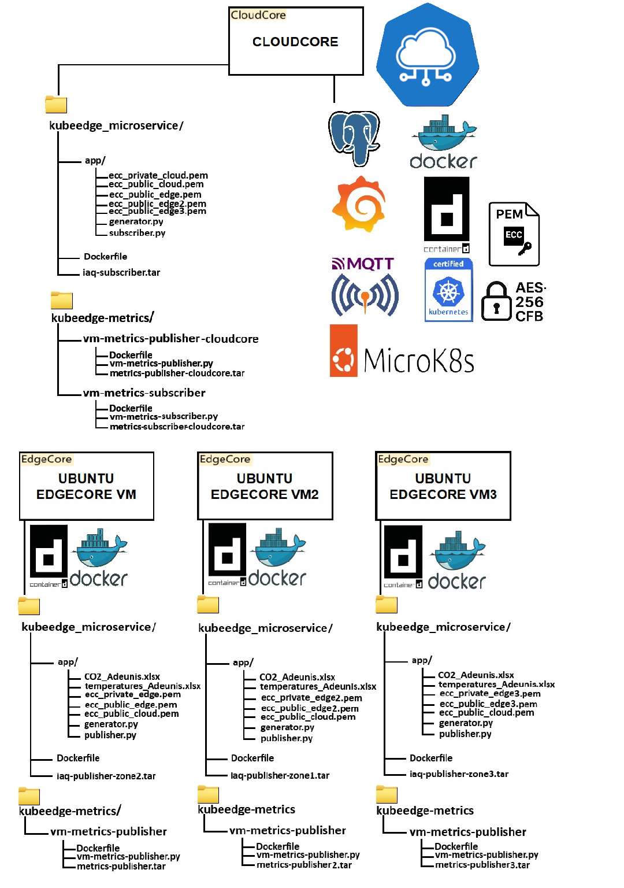

## SmartIAQ – KubeEdge
 **Configurazione ed implementazione di una rete basata su microservizi tramite la piattaforma KubeEdge.**  

  

 

---

## Obiettivo

Il progetto realizza un’infrastruttura **edge–cloud** basata su **microservizi containerizzati**, con orchestrazione tramite **KubeEdge**.  
Lo scenario d’uso riguarda il monitoraggio della qualità dell’aria indoor (*Indoor Air Quality – IAQ*) e delle risorse virtuali di un ambiente distribuito.

---

## Architettura generale

L’architettura si articola su due livelli principali:

- **Nodo CloudCore**  
  Coordina la rete, riceve e valida i dati pubblicati dai nodi edge, gestisce la persistenza tramite **PostgreSQL** e la visualizzazione tramite **Grafana**.  
  Componenti principali:
  - `subscriber/` – ricezione e decifratura dei messaggi IAQ  
  - `metrics-subscriber/` – raccolta e persistenza delle metriche di sistema
  - `vm-metrics-publisher-cloudcore/` – invio delle metriche di sistema della VM che ospita il CloudCore
  - `manifests/` – file YAML per il deploy su MicroK8s / KubeEdge  

- **Nodi Edge (EdgeCore)**  
  Simulano sensori e pubblicano dati cifrati e firmati digitalmente tramite protocollo **MQTT (Mosquitto)**.  
  Componenti principali:
  - `iaq-publisher-zoneX/` – pubblicazione dei parametri ambientali  
  - `vm-metrics-publisher/` – invio delle metriche delle VM  

La comunicazione è cifrata mediante **ECDHE + AES-256 in modalità CFB**, con firma **ECDSA** per garantire integrità e autenticità.

  

---

##  Struttura della repository

| Cartella | Contenuto |
|-----------|-----------|
| **CloudCore/** | Microservizi lato cloud e file di deploy |
| **EdgeCore/** | Microservizi lato edge e publisher |
| **SmartIAQ/** | Materiale di supporto: diagrammi, demo, dashboard e riassunto tesi |
| **dataset/** | Dataset di riferimento ([BuildPred – Grenoble](https://github.com/CampusIoT/datasets/tree/main/BuildPred)) utilizzato per le simulazioni |

---

## Riferimento completo

Il dettaglio dell’implementazione, delle configurazioni e delle metriche di valutazione è riportato nel <strong>capitolo di implementazione</strong> della tesi di laurea allegata.

   <a href="https://github.com/user-attachments/files/22922343/Tesi_Fuse_Lorenzo_753168.pdf" target="_blank">
  <strong>Tesi completa – “Configurazione ed implementazione di una rete basata su microservizi tramite la piattaforma KubeEdge”</strong>
  </a>

<strong>Autore:</strong> Lorenzo Fusè 
<strong>Relatrice:</strong> Prof.ssa Alessandra Rizzardi 
<strong>Correlatrice:</strong> Prof.ssa Sabrina Sicari 
<strong>Università degli Studi dell’Insubria – A.A. 2024/2025</strong>

